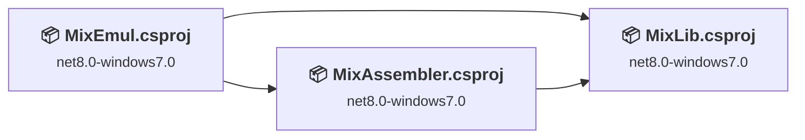
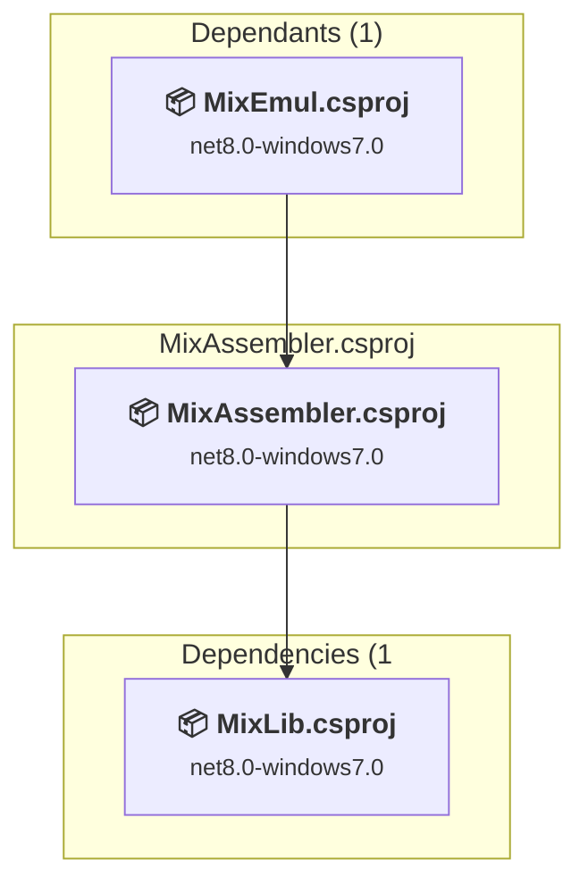
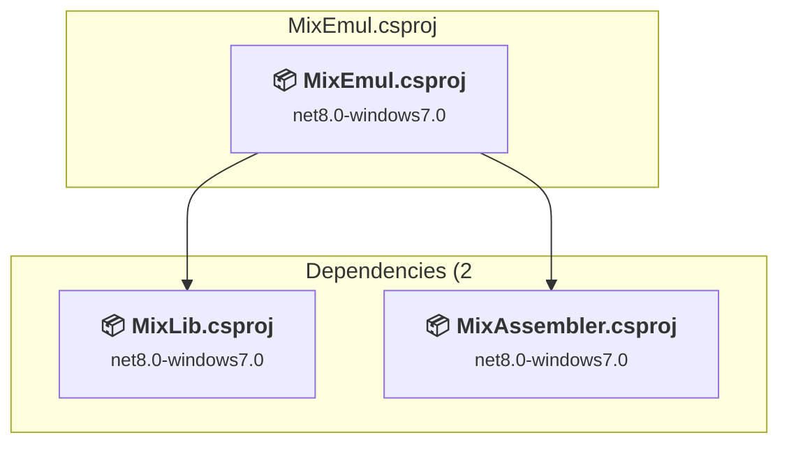
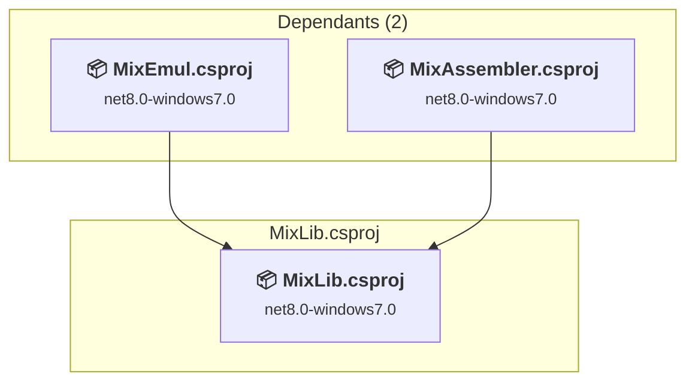

# Projects and dependencies analysis

This document provides a comprehensive overview of the projects and their dependencies in the context of upgrading to .NETCoreApp,Version=v10.0.

## Table of Contents

- [Executive Summary](#executive-Summary)
  - [Highlevel Metrics](#highlevel-metrics)
  - [Projects Compatibility](#projects-compatibility)
  - [Package Compatibility](#package-compatibility)
  - [API Compatibility](#api-compatibility)
- [Aggregate NuGet packages details](#aggregate-nuget-packages-details)
- [Top API Migration Challenges](#top-api-migration-challenges)
  - [Technologies and Features](#technologies-and-features)
  - [Most Frequent API Issues](#most-frequent-api-issues)
- [Projects Relationship Graph](#projects-relationship-graph)
- [Project Details](#project-details)

  - [src\MixAssembler\MixAssembler.csproj](#srcmixassemblermixassemblercsproj)
  - [src\MixEmul\MixEmul.csproj](#srcmixemulmixemulcsproj)
  - [src\MixLib\MixLib.csproj](#srcmixlibmixlibcsproj)

## Executive Summary

### Highlevel Metrics

| Metric | Count | Status |
| :--- | :---: | :--- |
| Total Projects | 3 | All require upgrade |
| Total NuGet Packages | 0 | All compatible |
| Total Code Files | 193 |  |
| Total Code Files with Incidents | 53 |  |
| Total Lines of Code | 24410 |  |
| Total Number of Issues | 13038 |  |
| Estimated LOC to modify | 13035+ | at least 53,4% of codebase |

### Projects Compatibility

| Project | Target Framework | Difficulty | Package Issues | API Issues | Est. LOC Impact | Description |
| :--- | :---: | :---: | :---: | :---: | :---: | :--- |
| [src\MixAssembler\MixAssembler.csproj](#srcmixassemblermixassemblercsproj) | net8.0-windows7.0 | 🟢 Low | 0 | 0 |  | ClassLibrary, Sdk Style = True |
| [src\MixEmul\MixEmul.csproj](#srcmixemulmixemulcsproj) | net8.0-windows7.0 | 🟡 Medium | 0 | 13035 | 13035+ | WinForms, Sdk Style = True |
| [src\MixLib\MixLib.csproj](#srcmixlibmixlibcsproj) | net8.0-windows7.0 | 🟢 Low | 0 | 0 |  | ClassLibrary, Sdk Style = True |

### Package Compatibility

| Status | Count | Percentage |
| :--- | :---: | :---: |
| ✅ Compatible | 0 | 0,0% |
| ⚠️ Incompatible | 0 | 0,0% |
| 🔄 Upgrade Recommended | 0 | 0,0% |
| ***Total NuGet Packages*** | ***0*** | ***100%*** |

### API Compatibility

| Category | Count | Impact |
| :--- | :---: | :--- |
| 🔴 Binary Incompatible | 12661 | High - Require code changes |
| 🟡 Source Incompatible | 374 | Medium - Needs re-compilation and potential conflicting API error fixing |
| 🔵 Behavioral change | 0 | Low - Behavioral changes that may require testing at runtime |
| ✅ Compatible | 18013 |  |
| ***Total APIs Analyzed*** | ***31048*** |  |

## Aggregate NuGet packages details

| Package | Current Version | Suggested Version | Projects | Description |
| :--- | :---: | :---: | :--- | :--- |

## Top API Migration Challenges

### Technologies and Features

| Technology | Issues | Percentage | Migration Path |
| :--- | :---: | :---: | :--- |
| Windows Forms | 12661 | 97,1% | Windows Forms APIs for building Windows desktop applications with traditional Forms-based UI that are available in .NET on Windows. Enable Windows Desktop support: Option 1 (Recommended): Target net9.0-windows; Option 2: Add <UseWindowsDesktop>true</UseWindowsDesktop>; Option 3 (Legacy): Use Microsoft.NET.Sdk.WindowsDesktop SDK. |
| GDI+ / System.Drawing | 374 | 2,9% | System.Drawing APIs for 2D graphics, imaging, and printing that are available via NuGet package System.Drawing.Common. Note: Not recommended for server scenarios due to Windows dependencies; consider cross-platform alternatives like SkiaSharp or ImageSharp for new code. |
| Windows Forms Legacy Controls | 7 | 0,1% | Legacy Windows Forms controls that have been removed from .NET Core/5+ including StatusBar, DataGrid, ContextMenu, MainMenu, MenuItem, and ToolBar. These controls were replaced by more modern alternatives. Use ToolStrip, MenuStrip, ContextMenuStrip, and DataGridView instead. |

### Most Frequent API Issues

| API | Count | Percentage | Category |
| :--- | :---: | :---: | :--- |
| T:System.Windows.Forms.Button | 850 | 6,5% | Binary Incompatible |
| T:System.Windows.Forms.Label | 842 | 6,5% | Binary Incompatible |
| T:System.Windows.Forms.AnchorStyles | 744 | 5,7% | Binary Incompatible |
| P:System.Windows.Forms.Control.Name | 308 | 2,4% | Binary Incompatible |
| T:System.Windows.Forms.ToolStripMenuItem | 296 | 2,3% | Binary Incompatible |
| P:System.Windows.Forms.Control.Size | 288 | 2,2% | Binary Incompatible |
| T:System.Windows.Forms.Control.ControlCollection | 277 | 2,1% | Binary Incompatible |
| P:System.Windows.Forms.Control.Controls | 277 | 2,1% | Binary Incompatible |
| M:System.Windows.Forms.Control.ControlCollection.Add(System.Windows.Forms.Control) | 273 | 2,1% | Binary Incompatible |
| P:System.Windows.Forms.Control.TabIndex | 268 | 2,1% | Binary Incompatible |
| P:System.Windows.Forms.Control.Location | 268 | 2,1% | Binary Incompatible |
| T:System.Windows.Forms.Keys | 257 | 2,0% | Binary Incompatible |
| T:System.Windows.Forms.FlatStyle | 243 | 1,9% | Binary Incompatible |
| T:System.Windows.Forms.CheckBox | 223 | 1,7% | Binary Incompatible |
| T:System.Windows.Forms.Padding | 216 | 1,7% | Binary Incompatible |
| T:System.Windows.Forms.TextBox | 196 | 1,5% | Binary Incompatible |
| T:System.Windows.Forms.GroupBox | 196 | 1,5% | Binary Incompatible |
| T:System.Windows.Forms.KeyEventHandler | 165 | 1,3% | Binary Incompatible |
| T:System.Windows.Forms.BorderStyle | 156 | 1,2% | Binary Incompatible |
| T:System.Windows.Forms.TabPage | 148 | 1,1% | Binary Incompatible |
| T:System.Windows.Forms.ComboBox | 144 | 1,1% | Binary Incompatible |
| T:System.Drawing.ContentAlignment | 135 | 1,0% | Source Incompatible |
| T:System.Windows.Forms.ToolStripButton | 122 | 0,9% | Binary Incompatible |
| P:System.Windows.Forms.Control.Anchor | 118 | 0,9% | Binary Incompatible |
| F:System.Windows.Forms.AnchorStyles.Right | 108 | 0,8% | Binary Incompatible |
| T:System.Windows.Forms.ListView | 106 | 0,8% | Binary Incompatible |
| F:System.Windows.Forms.AnchorStyles.Top | 94 | 0,7% | Binary Incompatible |
| P:System.Windows.Forms.Control.Margin | 94 | 0,7% | Binary Incompatible |
| M:System.Windows.Forms.Control.SuspendLayout | 93 | 0,7% | Binary Incompatible |
| T:System.Windows.Forms.DialogResult | 93 | 0,7% | Binary Incompatible |
| P:System.Windows.Forms.Label.Text | 91 | 0,7% | Binary Incompatible |
| T:System.Windows.Forms.Panel | 91 | 0,7% | Binary Incompatible |
| T:System.Windows.Forms.NumericUpDown | 90 | 0,7% | Binary Incompatible |
| M:System.Windows.Forms.Label.#ctor | 84 | 0,6% | Binary Incompatible |
| M:System.Windows.Forms.Padding.#ctor(System.Int32,System.Int32,System.Int32,System.Int32) | 84 | 0,6% | Binary Incompatible |
| F:System.Windows.Forms.FlatStyle.Flat | 81 | 0,6% | Binary Incompatible |
| M:System.Windows.Forms.Control.ResumeLayout(System.Boolean) | 76 | 0,6% | Binary Incompatible |
| P:System.Windows.Forms.ButtonBase.FlatStyle | 75 | 0,6% | Binary Incompatible |
| P:System.Windows.Forms.ButtonBase.Text | 72 | 0,6% | Binary Incompatible |
| T:System.Drawing.Font | 70 | 0,5% | Source Incompatible |
| T:System.Windows.Forms.Control | 69 | 0,5% | Binary Incompatible |
| T:System.Windows.Forms.ColumnHeader | 69 | 0,5% | Binary Incompatible |
| T:System.Windows.Forms.RichTextBox | 63 | 0,5% | Binary Incompatible |
| F:System.Windows.Forms.AnchorStyles.Left | 62 | 0,5% | Binary Incompatible |
| P:System.Windows.Forms.Control.Enabled | 62 | 0,5% | Binary Incompatible |
| T:System.Windows.Forms.ToolTip | 62 | 0,5% | Binary Incompatible |
| P:System.Windows.Forms.ToolStripItem.Text | 61 | 0,5% | Binary Incompatible |
| M:System.Windows.Forms.Button.#ctor | 60 | 0,5% | Binary Incompatible |
| P:System.Windows.Forms.Control.Width | 58 | 0,4% | Binary Incompatible |
| P:System.Windows.Forms.Control.Visible | 57 | 0,4% | Binary Incompatible |

## Projects Relationship Graph

Legend:
📦 SDK-style project
⚙️ Classic project

## Project Details

### src\MixAssembler\MixAssembler.csproj

#### Project Info

- **Current Target Framework:** net8.0-windows7.0
- **Proposed Target Framework:** net10.0--windows7.0
- **SDK-style**: True
- **Project Kind:** ClassLibrary
- **Dependencies**: 1
- **Dependants**: 1
- **Number of Files**: 32
- **Number of Files with Incidents**: 1
- **Lines of Code**: 1710
- **Estimated LOC to modify**: 0+ (at least 0,0% of the project)

#### Dependency Graph

Legend:
📦 SDK-style project
⚙️ Classic project

### API Compatibility

| Category | Count | Impact |
| :--- | :---: | :--- |
| 🔴 Binary Incompatible | 0 | High - Require code changes |
| 🟡 Source Incompatible | 0 | Medium - Needs re-compilation and potential conflicting API error fixing |
| 🔵 Behavioral change | 0 | Low - Behavioral changes that may require testing at runtime |
| ✅ Compatible | 1057 |  |
| ***Total APIs Analyzed*** | ***1057*** |  |

### src\MixEmul\MixEmul.csproj

#### Project Info

- **Current Target Framework:** net8.0-windows7.0
- **Proposed Target Framework:** net10.0-windows
- **SDK-style**: True
- **Project Kind:** WinForms
- **Dependencies**: 2
- **Dependants**: 0
- **Number of Files**: 93
- **Number of Files with Incidents**: 51
- **Lines of Code**: 15059
- **Estimated LOC to modify**: 13035+ (at least 86,6% of the project)

#### Dependency Graph

Legend:
📦 SDK-style project
⚙️ Classic project

### API Compatibility

| Category | Count | Impact |
| :--- | :---: | :--- |
| 🔴 Binary Incompatible | 12661 | High - Require code changes |
| 🟡 Source Incompatible | 374 | Medium - Needs re-compilation and potential conflicting API error fixing |
| 🔵 Behavioral change | 0 | Low - Behavioral changes that may require testing at runtime |
| ✅ Compatible | 12431 |  |
| ***Total APIs Analyzed*** | ***25466*** |  |

#### Project Technologies and Features

| Technology | Issues | Percentage | Migration Path |
| :--- | :---: | :---: | :--- |
| Windows Forms Legacy Controls | 7 | 0,1% | Legacy Windows Forms controls that have been removed from .NET Core/5+ including StatusBar, DataGrid, ContextMenu, MainMenu, MenuItem, and ToolBar. These controls were replaced by more modern alternatives. Use ToolStrip, MenuStrip, ContextMenuStrip, and DataGridView instead. |
| GDI+ / System.Drawing | 374 | 2,9% | System.Drawing APIs for 2D graphics, imaging, and printing that are available via NuGet package System.Drawing.Common. Note: Not recommended for server scenarios due to Windows dependencies; consider cross-platform alternatives like SkiaSharp or ImageSharp for new code. |
| Windows Forms | 12661 | 97,1% | Windows Forms APIs for building Windows desktop applications with traditional Forms-based UI that are available in .NET on Windows. Enable Windows Desktop support: Option 1 (Recommended): Target net9.0-windows; Option 2: Add <UseWindowsDesktop>true</UseWindowsDesktop>; Option 3 (Legacy): Use Microsoft.NET.Sdk.WindowsDesktop SDK. |

### src\MixLib\MixLib.csproj

#### Project Info

- **Current Target Framework:** net8.0-windows7.0
- **Proposed Target Framework:** net10.0--windows7.0
- **SDK-style**: True
- **Project Kind:** ClassLibrary
- **Dependencies**: 0
- **Dependants**: 2
- **Number of Files**: 93
- **Number of Files with Incidents**: 1
- **Lines of Code**: 7641
- **Estimated LOC to modify**: 0+ (at least 0,0% of the project)

#### Dependency Graph

Legend:
📦 SDK-style project
⚙️ Classic project

### API Compatibility

| Category | Count | Impact |
| :--- | :---: | :--- |
| 🔴 Binary Incompatible | 0 | High - Require code changes |
| 🟡 Source Incompatible | 0 | Medium - Needs re-compilation and potential conflicting API error fixing |
| 🔵 Behavioral change | 0 | Low - Behavioral changes that may require testing at runtime |
| ✅ Compatible | 4525 |  |
| ***Total APIs Analyzed*** | ***4525*** |  |

